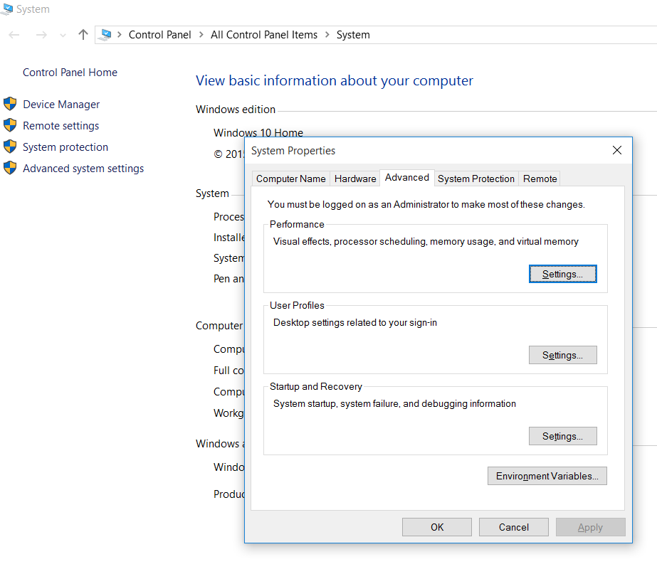
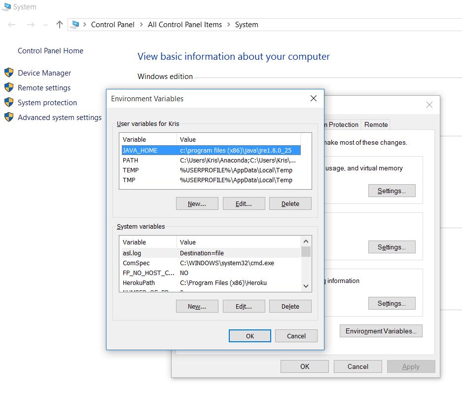
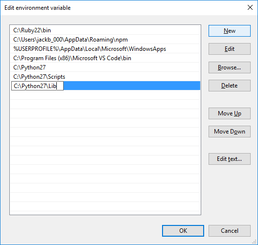
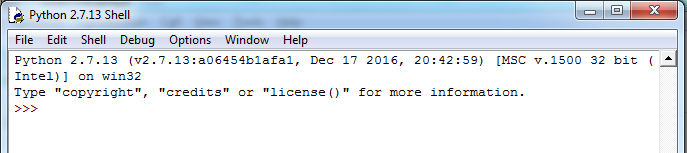

# Installing Python (MacOS)
## If you're installing on PC, skip to that section.

To install python, we will use homebrew, a package manager that helps us install software on our operating system.

1. Install GCC
First, we need to install GCC. This is a collection of compilers for C, C++, Objective-C, and Java. But for now, all we need to know is that we need this in order to get homebrew working on our system.

Before you proceed, run this command in your terminal:
```
gcc -v
```
If the output looks something like this, you can skip to step 2:

```
Configured with: --prefix=/Applications/Xcode.app/Contents/Developer/usr --with-gxx-include-dir=/usr/include/c++/4.2.1
Apple LLVM version 8.1.0 (clang-802.0.42)
Target: x86_64-apple-darwin16.7.0
Thread model: posix
InstalledDir: /Applications/Xcode.app/Contents/Developer/Toolchains/XcodeDefault.xctoolchain/usr/bin
```

Otherwise, go to this link and follow the directions:  http://www.mkyong.com/mac/how-to-install-gcc-compiler-on-mac-os-x/

You'll need to log in with your Apple ID to do this. If you're already a Mac user, you should already have one. Don't worry! It doesn't cost anything. After you've signed in, make sure your computer is updated, and then go ahead and download the most recent version of the Command Line Tools for Xcode.

2. Install Homebrew
Now we can go ahead and install homebrew.

Open up your terminal and run this command:

```
ruby -e "$(curl -fsSL https://raw.githubusercontent.com/Homebrew/install/master/install)"
```
The script will explain what changes it will make and prompt you before the installation begins. Once installed, we need to make sure our system knows where to look for homebrew so we can easily execute commands without having to write long file paths. We can do this by entering the following:

```
cd ~
nano .bash_profile
```

What the last command did was open up a hidden file called .bash_profile that allows us to configure our terminal. Now copy and paste the following code at the bottom of your .bash_profile:

```
export PATH=/usr/local/bin:/usr/local/sbin:$PATH
```

Once you've done that, press "cmd + x" (or "ctrl + x" to some machines) to exit. When you are prompted to accept changes made, hit the 'y' key and then press 'enter' key to save your changes. Basically, we just told your computer where to look in order to find the homebrew commands we will be using in the future! You can check to see if this all worked by restarting your terminal and then typing in the following command:

```
brew
```
Your output should look like the following, giving you more info on how to use homebrew:

```
Example usage:
  brew search [TEXT|/REGEX/]
  brew (info|home|options) [FORMULA...]
  brew install FORMULA...
  brew update
  brew upgrade [FORMULA...]
  brew uninstall FORMULA...
  brew list [FORMULA...]

Troubleshooting:
  brew config
  brew doctor
  brew install -vd FORMULA

Developers:
  brew create [URL [--no-fetch]]
  brew edit [FORMULA...]
  http://docs.brew.sh/Formula-Cookbook.html

Further help:
  man brew
  brew help [COMMAND]
  brew home
```

3. Install Python
Now that we have homebrew working, we can install python by simply typing:

```python
brew update #this updates homebrew

brew install python #this installs Python
```

Updating and installation might take a few minutes. If there are any other problems, homebrew helps us out by telling us certain commands we might need to run to properly install things. Read through the outputs and run the recommended commands. Otherwise, we can check the version and then run python in our terminal to see if it is working:

```
python -V # type this command
```

// Python 2.7.13  # if it outputs something like this, we have the right version. You might see 2.7.10 etc.

```python
python #type this command to start the python shell
```

The python shell looks like the below:

```
Python 2.7.13 (default, Apr  4 2017, 08:47:57)
[GCC 4.2.1 Compatible Apple LLVM 8.1.0 (clang-802.0.38)] on darwin
Type "help", "copyright", "credits" or "license" for more information.
>>>
```


Congratulations! You now have an updated, working version of Python 2.7.x on your computer! You can type `exit()` in your Python shell to exit :)


# Installing Python (Windows)

To install python, we will download Python directly from Python's website: [Download](https://www.python.org/downloads/release/python-2713/)

We will have to set a PATH environment variable. To do this we navigate to our Advanced System Settings of your computer. Go to `Control Panel->Advanced System Settings-> Advanced-> Environment Variables`:



At this point, we can click Environment Variables to set up the Python executable for our Command Prompt.




Here we see that there is already a PATH variable declared with some other file path directories already set up.

(Yours may look different and you may not have a PATH variable declared so click New and add `PATH` as a variable name)

Highlight the Path variable, then click edit. From here, add the following lines with "New":

```
C:\Python27
C:\Python27\Scripts
C:\Python27\Lib
```




We can check the version and then run python in our terminal to see if it is working:

```python
python -V # type this command
Python 2.7.13  # if it outputs something like this, we have the right version. You might see 2.7.10 etc.
python # type this command to start the python shell
```

When we start the python shell, it will look like:



Congratulations! You now have an updated, working version of Python 2.7.x on your computer! You can type exit() in your Python shell to exit.

Installing Pip:
We will be using Pip, which will allow us to download packages for us to use with Python. As of version 2.7.9, Pip was included as a Script in our Python download. Try running `python -m pip -V`. If it says something like pip 8.1.2 from ... then everything worked! However, if you have issues running the Pip command you may have to install it locally first. These directions here or here should help you install Pip.

Some computers have issues with getting Pip to work in GitBash, even after their PATH variables are set and everything works in CMD.

If your computer has this issue and you get an error like "'pip' is not recognized as an internal or external command", try typing the following into your GitBash terminal:

  `setx PATH "%PATH%;C:\Python27\Scripts"`

Once you're done with that, you'll need to quit GitBash and restart the program.
